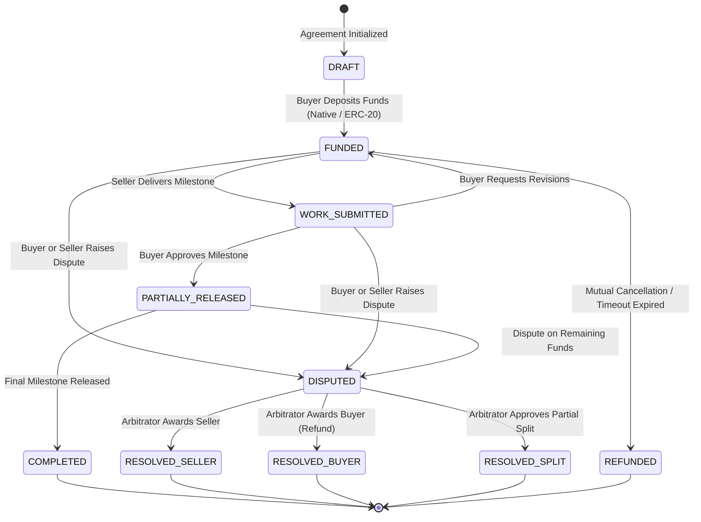
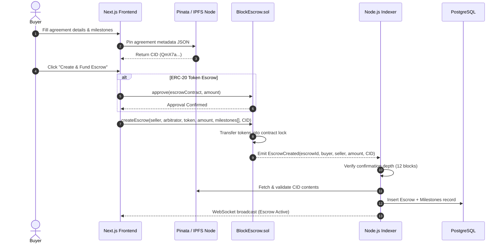
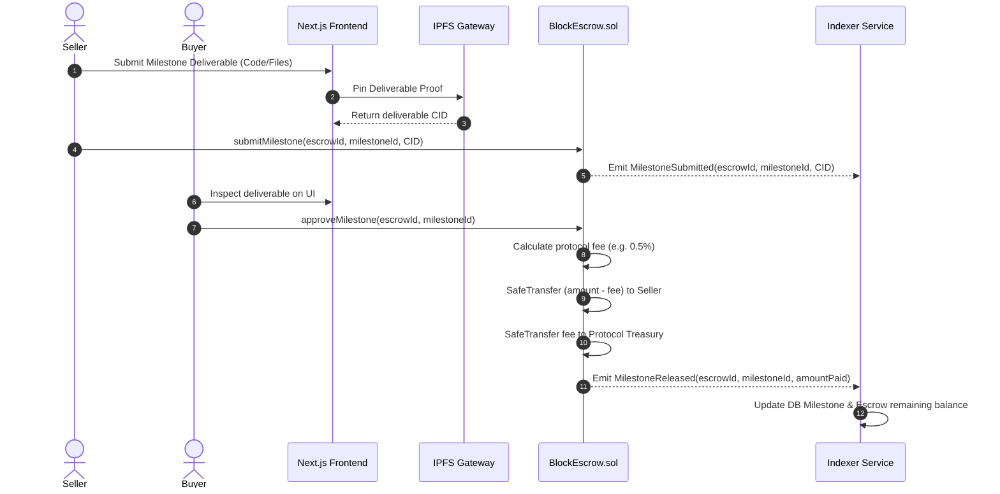
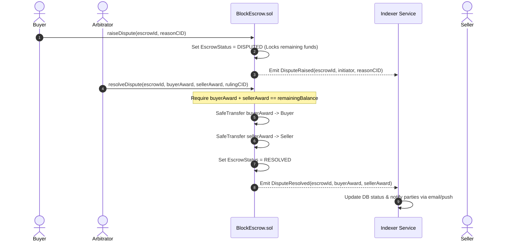

# BlockEscrow – System Architecture Specification (`architecture.md`)

> **Document Version:** 1.0.0  
> **System Classification:** Multi-Party Non-Custodial Blockchain Escrow & Dispute Resolution Protocol  
> **Target Networks:** Ethereum (EVM), Polygon PoS, Arbitrum One  
> **Supported Assets:** Native (ETH/MATIC) and Standard ERC-20 Tokens (USDC, USDT, DAI)

---

## 1. High-Level Architecture Overview

BlockEscrow is an enterprise-grade decentralized escrow platform designed to facilitate secure peer-to-peer and multi-party milestone payments. Off-chain business agreements are cryptographically bound to on-chain smart contracts via IPFS content addressing.

```
                    ┌─────────────────────────┐
                    │     React / Next.js     │
                    │      Frontend App       │
                    │ (App Router + Wagmi v2) │
                    └────────────┬────────────┘
                                 │
                     viem / EIP-1193 / EIP-712
                                 │
               ┌─────────────────▼─────────────────┐
               │         Ethereum / Polygon        │
               │                                   │
               │       BlockEscrow Contract        │
               │                                   │
               │  • Create Escrow   • Milestones   │
               │  • Lock Funds      • Dispute Res  │
               │  • Release Funds   • Fee Engine   │
               │  • Refund Engine   • Emergency    │
               └─────────────────┬─────────────────┘
                                 │
                    WebSocket / JSON-RPC Events
                                 │
               ┌─────────────────▼─────────────────┐
               │          Node.js API              │
               │                                   │
               │   Event Indexer / Reorg Engine    │
               │   Business APIs / BullMQ Queues   │
               └────────────┬────────────┬─────────┘
                            │            │
                   ┌────────▼───┐    ┌───▼─────────┐
                   │ PostgreSQL │    │    Redis    │
                   │  Database  │    │ Cache/Queue │
                   └────────────┘    └─────────────┘
                                 │
                          ┌──────▼──────┐
                          │    IPFS     │
                          │ Agreements  │
                          │ & Evidence  │
                          └─────────────┘
```

---

## 2. Smart Contract Architecture

The core on-chain protocol follows an upgradeable proxy pattern (UUPS) or modular diamond architecture, incorporating OpenZeppelin security standards.

### 2.1 Contract Hierarchy & Inheritance

```
OpenZeppelin Contracts:
├── Initializable
├── ReentrancyGuardUpgradeable
├── PausableUpgradeable
├── AccessControlUpgradeable
└── SafeERC20 / IERC20

Custom Implementations:
└── BlockEscrow.sol (Implements IBlockEscrow, IEscrowEvents, IDisputeManager)
```

### 2.2 Escrow State Machine



### 2.3 On-Chain Data Structures

```solidity
// SPDX-License-Identifier: MIT
pragma solidity ^0.8.24;

enum EscrowStatus {
    DRAFT,
    FUNDED,
    IN_PROGRESS,
    COMPLETED,
    DISPUTED,
    RESOLVED,
    REFUNDED,
    CANCELLED
}

enum MilestoneStatus {
    PENDING,
    SUBMITTED,
    APPROVED,
    DISPUTED
}

struct Milestone {
    uint256 milestoneId;
    string title;
    uint256 amount;
    uint256 deadline;
    MilestoneStatus status;
    string submissionIpfsHash; // Deliverable proof
    uint256 submittedAt;
    uint256 approvedAt;
}

struct EscrowAgreement {
    uint256 escrowId;
    address buyer;
    address seller;
    address arbitrator;
    address tokenAddress; // address(0) for native ETH/MATIC
    uint256 totalAmount;
    uint256 remainingBalance;
    uint256 feeBasisPoints; // e.g., 50 = 0.5%
    string agreementIpfsHash; // Legal/technical terms
    EscrowStatus status;
    uint256 createdAt;
    uint256 lockedUntil;
    uint256 milestoneCount;
}

struct DisputeRecord {
    uint256 disputeId;
    uint256 escrowId;
    address initiator;
    string reasonIpfsHash;
    uint256 buyerAwardAmount;
    uint256 sellerAwardAmount;
    uint256 resolvedAt;
    bool isResolved;
}
```

### 2.4 Smart Contract Security Invariants

1. **Conservation of Value:** At all times:
   $$\text{Contract Token Balance} \ge \sum \text{Remaining Balances} + \text{Unclaimed Protocol Fees}$$
2. **Reentrancy Protection:** All external transfer calls invoke `nonReentrant` modifiers and strictly follow the **Checks-Effects-Interactions (CEI)** pattern.
3. **Pull Over Push Payments:** Disputed awards and refunds are recorded in state balances and released through explicit user-triggered withdrawals or atomic safe transfers.
4. **Decimals Handling:** Strict normalization for tokens like USDC (6 decimals) versus standard 18 decimal tokens.
5. **Emergency Pausing:** When `paused() == true`, no new escrows can be created or funded. Fund withdrawals for already completed/resolved escrows remain accessible or governed by multi-sig timelocks.

---

## 3. Backend & Blockchain Event Indexing Engine

The backend operates as an event-driven microservice using **Node.js, TypeScript, PostgreSQL, and Redis**.

```
                   Blockchain RPC (WebSocket)
                                │
                        [Event Listener]
                                │
                     [Reorg Detection Engine]
                   (Buffer: N Blocks Depth)
                                │
                      [BullMQ Job Queue]
                                │
                    ┌───────────┴───────────┐
                    ▼                       ▼
            [Postgres Writer]       [Redis Cache Purger]
            (Event Sourced)         (Pub/Sub WebSockets)
```

### 3.1 Reorganization (Reorg) Resilience Engine
Public blockchains experience temporary chain forks. To prevent false off-chain state updates:
- **Confirmation Depth:** 
  - Polygon PoS: 32 blocks (~64 seconds)
  - Arbitrum One: 12 blocks (~3 seconds)
  - Ethereum Mainnet: 12 blocks (~2.5 minutes)
- **Two-Phase Commit Tracking:**
  1. `UNCONFIRMED_EVENT`: Event picked up instantly at block $H$; status marked as pending in Redis and notified to UI via WebSockets.
  2. `CONFIRMED_EVENT`: When block $H + \text{depth}$ is finalized, transaction is persisted to PostgreSQL and final state is locked.
  3. `REORG_DETECTED`: If the block hash at height $H$ diverges during validation, all intermediate updates are rolled back to the previous canonical block.

### 3.2 Database Schema (PostgreSQL / Prisma)

```prisma
datasource db {
  provider = "postgresql"
  url      = env("DATABASE_URL")
}

generator client {
  provider = "prisma-client-js"
}

enum Role {
  BUYER
  SELLER
  ARBITRATOR
  ADMIN
}

enum EscrowState {
  DRAFT
  FUNDED
  IN_PROGRESS
  COMPLETED
  DISPUTED
  RESOLVED
  REFUNDED
  CANCELLED
}

model User {
  id              String      @id @default(uuid())
  walletAddress   String      @unique
  role            Role        @default(BUYER)
  nonce           String      // For SIWE (Sign-In with Ethereum)
  username        String?
  email           String?
  createdAt       DateTime    @default(now())
  updatedAt       DateTime    @updatedAt
  
  buyerEscrows    Escrow[]    @relation("BuyerEscrows")
  sellerEscrows   Escrow[]    @relation("SellerEscrows")
  arbitrated      Escrow[]    @relation("ArbitratorEscrows")
}

model Escrow {
  id                  String       @id @default(uuid())
  onChainEscrowId     Int?         @unique
  networkChainId      Int
  buyerAddress        String
  sellerAddress       String
  arbitratorAddress   String
  tokenAddress        String       // "0x0" for native
  totalAmount         Decimal      @db.Decimal(36, 18)
  remainingBalance    Decimal      @db.Decimal(36, 18)
  status              EscrowState  @default(DRAFT)
  agreementIpfsHash   String
  txHash              String?      @unique
  blockNumber         BigInt?
  createdAt           DateTime     @default(now())
  updatedAt           DateTime     @updatedAt

  buyer               User         @relation("BuyerEscrows", fields: [buyerAddress], references: [walletAddress])
  seller              User         @relation("SellerEscrows", fields: [sellerAddress], references: [walletAddress])
  arbitrator          User         @relation("ArbitratorEscrows", fields: [arbitratorAddress], references: [walletAddress])
  
  milestones          Milestone[]
  disputes            Dispute[]
  auditLogs           AuditLog[]

  @@index([buyerAddress])
  @@index([sellerAddress])
  @@index([status])
  @@index([networkChainId, onChainEscrowId])
}

model Milestone {
  id                  String       @id @default(uuid())
  escrowId            String
  onChainIndex        Int
  title               String
  description         String?
  amount              Decimal      @db.Decimal(36, 18)
  deadline            DateTime
  status              String       @default("PENDING")
  deliverableIpfsHash String?
  txHash              String?
  
  escrow              Escrow       @relation(fields: [escrowId], references: [id], onDelete: Cascade)

  @@unique([escrowId, onChainIndex])
}

model Dispute {
  id                  String       @id @default(uuid())
  escrowId            String
  onChainDisputeId    Int?
  initiatorAddress    String
  reasonIpfsHash      String
  buyerAward          Decimal?     @db.Decimal(36, 18)
  sellerAward         Decimal?     @db.Decimal(36, 18)
  isResolved          Boolean      @default(false)
  rulingNotes         String?
  txHash              String?
  createdAt           DateTime     @default(now())
  resolvedAt          DateTime?

  escrow              Escrow       @relation(fields: [escrowId], references: [id])
}

model EventCursor {
  chainId             Int          @id
  lastProcessedBlock  BigInt
  updatedAt           DateTime     @updatedAt
}

model AuditLog {
  id                  String       @id @default(uuid())
  escrowId            String
  action              String
  actorAddress        String
  payload             Json
  timestamp           DateTime     @default(now())

  escrow              Escrow       @relation(fields: [escrowId], references: [id])
}
```

---

## 4. IPFS Metadata & Off-Chain Document Engine

To maintain decentralization without inflating on-chain storage gas costs, all contractual details, deliverables, code hashes, and dispute claims are stored on IPFS.

### 4.1 Agreement Metadata Schema (`agreement.schema.json`)
```json
{
  "$schema": "http://json-schema.org/draft-07/schema#",
  "title": "BlockEscrowAgreement",
  "type": "object",
  "properties": {
    "version": { "type": "string", "enum": ["1.0.0"] },
    "title": { "type": "string", "maxLength": 120 },
    "description": { "type": "string" },
    "buyer": { "type": "string", "pattern": "^0x[a-fA-F0-9]{40}$" },
    "seller": { "type": "string", "pattern": "^0x[a-fA-F0-9]{40}$" },
    "arbitrator": { "type": "string", "pattern": "^0x[a-fA-F0-9]{40}$" },
    "tokenSymbol": { "type": "string" },
    "totalAmount": { "type": "string" },
    "milestones": {
      "type": "array",
      "items": {
        "type": "object",
        "properties": {
          "index": { "type": "integer" },
          "title": { "type": "string" },
          "deliverables": { "type": "string" },
          "amount": { "type": "string" },
          "dueDate": { "type": "string", "format": "date-time" }
        },
        "required": ["index", "title", "amount", "dueDate"]
      }
    },
    "disputeTerms": {
      "arbitrationFeeBps": { "type": "integer" },
      "evidenceWindowDays": { "type": "integer" }
    },
    "attachments": {
      "type": "array",
      "items": {
        "name": { "type": "string" },
        "cid": { "type": "string" },
        "sha256": { "type": "string" }
      }
    }
  },
  "required": ["version", "title", "buyer", "seller", "totalAmount", "milestones"]
}
```

### 4.2 Dual-Pinning Architecture
1. **Primary Node:** Dedicated IPFS Cluster node run on AWS/Kubernetes.
2. **Secondary Fallback:** Automated pinning via **Pinata API** and **Web3.Storage / Filecoin**.
3. **Gateway Redundancy:** Frontend reads via multiple gateways (`https://ipfs.io/ipfs/`, `https://gateway.pinata.cloud/ipfs/`, and private dedicated gateway).

---

## 5. End-to-End Interaction Sequences

### 5.1 Escrow Creation & Funding Sequence



### 5.2 Milestone Approval & Fund Release



### 5.3 Dispute Raising & Arbitration Resolution



---

## 6. Frontend Web3 Architecture

```
src/
├── app/                      # Next.js 14 App Router
│   ├── (auth)/login/         # SIWE Wallet login
│   ├── dashboard/            # Overview of active/past escrows
│   ├── escrow/
│   │   ├── create/           # Multi-step escrow wizard
│   │   └── [id]/             # Escrow detail, milestones, & dispute room
│   ├── arbitrator/           # Arbitrator dashboard & case review
│   └── api/                  # BFF (Backend-for-Frontend) Proxy routes
├── components/
│   ├── escrow/               # MilestoneStepper, DisputeModal, DepositButton
│   ├── web3/                 # WalletConnectModal, NetworkSwitchBanner
│   └── ui/                   # shadcn/ui custom primitives
├── hooks/
│   ├── useBlockEscrow.ts     # Viem contract write hooks
│   ├── useEscrowDetails.ts   # TanStack Query + WebSocket sync
│   └── useSIWE.ts            # Sign-In with Ethereum authentication
└── lib/
    ├── contracts/            # ABIs and Typechain/Wagmi generated types
    ├── ipfs.ts               # Pinata client & gateway fallback fetcher
    └── wagmi.ts              # Chain configs (Polygon, Arbitrum, Sepolia)
```
